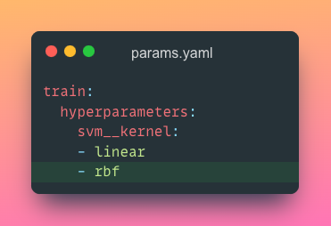
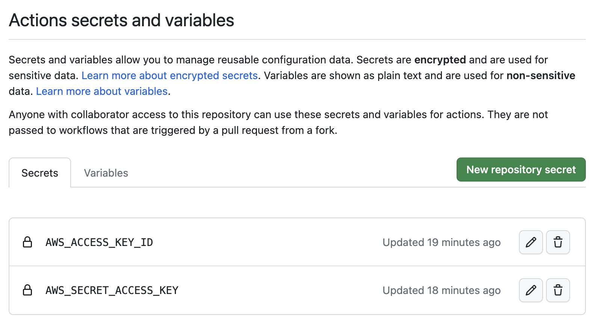
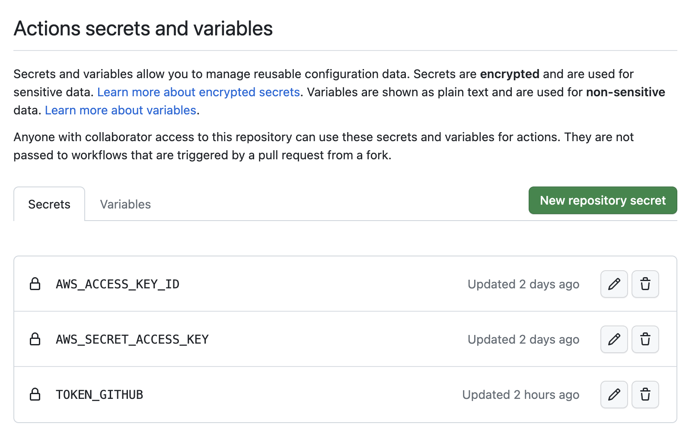

# Continuous Integration for Machine Learning Models

This is a sample project that showcases how to use CI for machine learning models.

## Why?
Continuous Integration (CI) is the practice of continuously merging and testing code changes into a shared repository. In a machine learning project, CI can be very useful for several reasons:

- Catching errors early: CI facilitates the early identification of errors by automatically testing any code changes made, enabling timely problem detection during the development phase
- Ensuring reproducibility: CI helps ensure reproducibility by establishing clear and consistent testing procedures, making it easier to replicate machine learning project results.
- Faster feedback and decision-making: By providing clear metrics and parameters, CI enables faster feedback and decision-making, freeing up reviewer time for more critical tasks.

## Scenario
- Data scientists make changes to the code, creating a new model locally.
- Data scientists push the new model to remote storage.
- Data scientists create a pull request for the changes.
- A CI pipeline is triggered to test the code and model.
- If all tests pass, the changes are merged into the main branch.

## CI Pipeline
- Pull data and model from a remote storage
- Run tests
- Automatically generate metrics report

## Tools Used in This Project
* [DVC](https://dvc.org/): Version data and experiments - [article](https://towardsdatascience.com/introduction-to-dvc-data-version-control-tool-for-machine-learning-projects-7cb49c229fe0)
* [CML](https://cml.dev/doc): Post a comment to the pull request showing the metrics and parameters of an experiment

## Project Structure
* `src`: consists of Python scripts
* `data`: consists of data
* `tests`: consists of test files
* `dvclive`: consists of metrics of DVC experiments
* `.dvc/config`: consists of locations of the remote storage
* `params.yaml`: consists of parameters for Python scripts
* `.github/workflows`: consists of GitHub workflows

## Try it out
### Set up
To try out this project, first start with cloning the project to your local machine:
```bash
git clone https://github.com/khuyentran1401/cicd-mlops-demo
```

Set up the environment:
```bash
# Go to the project directory
cd cicd-mlops-demo

# Install dependencies
pip install -r requirements.txt

# Pull data from the remote storage location called read 
dvc pull -r read
```

### Create experiments
Make changes to any files in the following directories `src`, `tests`, `params.yaml`. To demonstrate, we will make minor changes the file `params.yaml`:



Create an experiment:
```bash
dvc exp run
```

### Push model and data to a remote storage
After running the experiments, we need to store changes to our data and model remotely. One option is to use an S3 bucket as a remote storage.

Follow these steps to push your data and model to an S3 bucket:

1. [Create an S3 bucket](https://docs.aws.amazon.com/AmazonS3/latest/userguide/creating-bucket.html)
2. Ensure [your S3 credentials are store locally](https://docs.aws.amazon.com/cli/latest/userguide/cli-configure-files.html#cli-configure-files-methods).
3. Add the URI of your S3 bucket to the `.dvc/config` file


4. Push changes a remote location called `read-write` using:
```bash
dvc push -r read-write
```

### Push code changes to Git

Add, commit, and push changes to the repository:

```bash
git add .
git commit -m 'add 100 for C'
git push origin main
```

### Add Encrypted Secrets to GitHub Action
Encrypted secrets allows you to store your sensitive information in your repository. We will use encrypted secrets to make AWS credentials and GitHub token accessible by GitHub Actions.
#### AWS credentials
AWS credentials are necessary to pull data and model from your S3 bucket. Follow [this tutorial](https://docs.github.com/en/actions/security-guides/encrypted-secrets) to add `AWS_ACCESS_KEY_ID` and `AWS_SECRET_ACCESS_KEY` secrets to your repository.



#### GitHub token
GitHub token is necessary to write metrics and parameters as a comment in your pull request. To use GitHub token as an encrypted secret, follow these steps:
1. Create [a personal access token](https://docs.github.com/en/authentication/keeping-your-account-and-data-secure/creating-a-personal-access-token) 
2. Create a secret named `TOKEN_GITHUB` 
3. In the "Value" field, paste the token that you created in step 1.


### Create a Pull Request
Next, [create a pull request](https://docs.github.com/en/pull-requests/collaborating-with-pull-requests/proposing-changes-to-your-work-with-pull-requests/creating-a-pull-request)

Once creating a PR, a GitHub workflow will start to run tests. Once all tests passed, a comment will appear in the PR with the metrics and parameters of the new experiment. 


