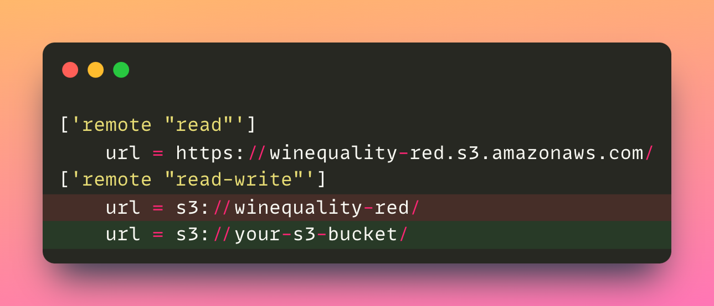

# Continuous Integration for Machine Learning Models

This is a sample project that showcases how to use CI for machine learning models.

## Why?
Continuous Integration (CI) is the practice of continuously merging and testing code changes into a shared repository. In a machine learning project, CI can be very useful for several reasons:

- Catching errors early: With CI, any changes made to the codebase are automatically tested, which helps catch any errors early in the development cycle.

- Ensuring reproducibility: Running tests on the codebase ensures that the codebase is reproducible.

- Facilitating collaboration: With CI, everyone on the team is working with the same codebase, and everyone can see changes made by other team members. This can help prevent conflicts and facilitate collaboration.

## Scenario
- Data scientists make some changes to the code and create a new model locally
- Data scientists push model and data to S3
- Data scientists create a pull request for the changes
- A CI pipeline is kicked off to test the data and model

## Pipeline overview
- Pull data and model from a remote storage
- Run tests
- Automatically generate metrics report (optional)
- If all tests passed, the code is merged to the main branch

## Tools Used in This Project
* [poetry](https://python-poetry.org/): Manage Python dependencies - [article](https://towardsdatascience.com/how-to-effortlessly-publish-your-python-package-to-pypi-using-poetry-44b305362f9f)
* [DVC](https://dvc.org/): Version data and experiments - [article](https://towardsdatascience.com/introduction-to-dvc-data-version-control-tool-for-machine-learning-projects-7cb49c229fe0)

## Project Structure
* `src`: consists of Python scripts
* `data`: consists of data
* `tests`: consists of test files
* `dvclive`: consists of metrics of DVC experiments
* `params.yaml`: consists of parameters for Python scripts

## Try it out
### Set up
To try out this project, first start with cloning the project to your local machine:
```bash
git clone https://github.com/khuyentran1401/cicd-mlops-demo
```

Next, setup the environment by following these steps:
1. Install [Poetry](https://python-poetry.org/docs/#installation) (1.4.0)
```bash
pip install poetry==1.4.0
```
2. Set up the environment:
```bash
# Install dependencies
poetry install --without dev

# Pull data from the remote storage 
make data
```

### Create experiments
Make changes to any files in the following directories `src`, `tests`, `conf`. To demonstrate, we will make minor changes the file `conf/config.yaml`:


Create an experiment:
```bash
make experiment
```

### Push model and data to a remote storage
After running the experiments, we need to store changes to our data and model remotely. One option is to use an S3 bucket as a remote storage.

Follow these steps to push your data and model to an S3 bucket:

1. [Create an S3 bucket](https://docs.aws.amazon.com/AmazonS3/latest/userguide/creating-bucket.html)
2. Ensure [your S3 credentials are store locally](https://docs.aws.amazon.com/cli/latest/userguide/cli-configure-files.html#cli-configure-files-methods).
3. Add the URI of your S3 bucket to the `.dvc/config` file


4. Push changes to using:
```bash
make push_data
```

### Push code changes to Git

Add, commit, and push changes to the repository:

```bash
git add .
git commit -m 'add 100 for C'
git push origin main
```

### Add AWS credentials to GitHub Action
To enable GitHub Actions to access your AWS credentials for pulling data and model from your S3 bucket, you can securely store your sensitive information with encrypted secrets. Follow [this tutorial]((https://docs.github.com/en/actions/security-guides/encrypted-secrets)) to add `AWS_ACCESS_KEY_ID` and `AWS_SECRET_ACCESS_KEY` secrets to your repository.


### Create a Pull Request
[Create a pull request](https://docs.github.com/en/pull-requests/collaborating-with-pull-requests/proposing-changes-to-your-work-with-pull-requests/creating-a-pull-request) and a GitHub job will be triggered:


